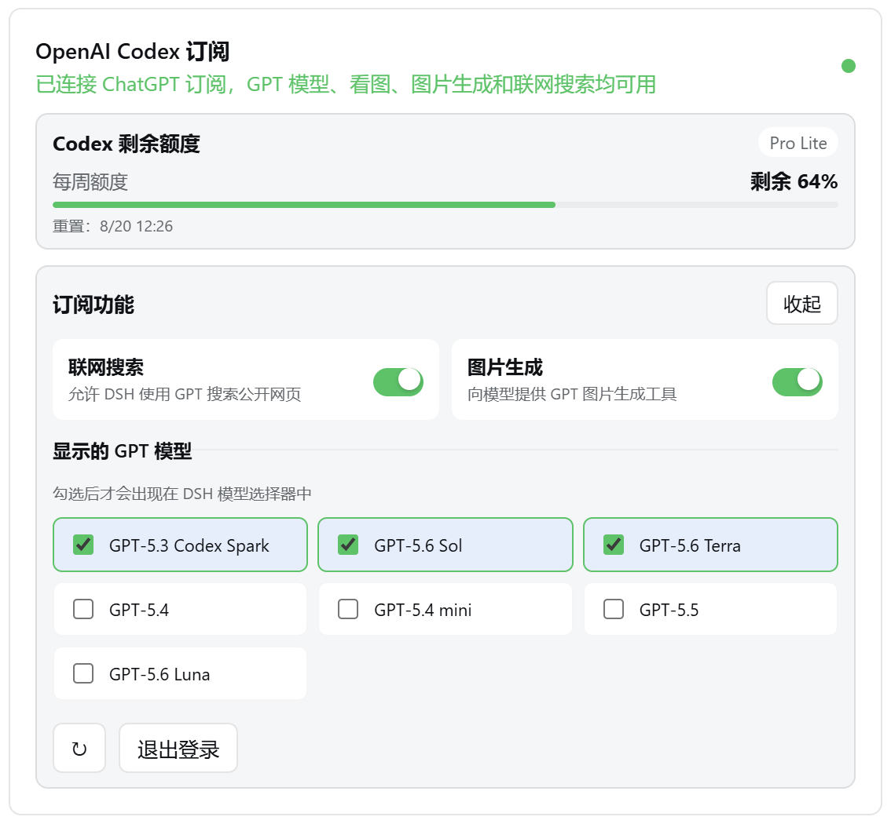
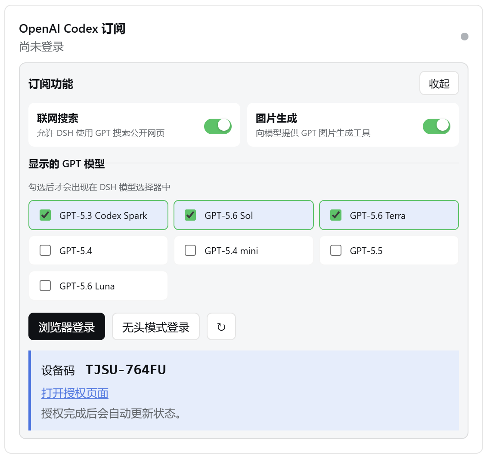
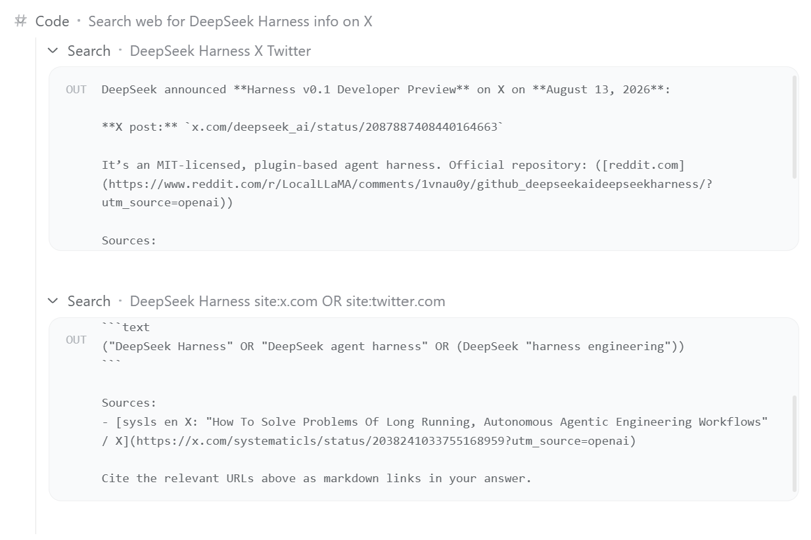

# 🔐 DSH-Codex-OAuth

[English](README.md) | 简体中文

> **🎯 功能：** 通过 ChatGPT / Codex 订阅登录，在 DeepSeek Harness 中畅享 GPT 的强大模型、图片生成、联网搜索功能，并支持订阅额度。<br>
> **🧩 兼容性：** 已在 DSH `0.1.0-rc.6` 上验证，后续版本将在 DSH 最新版本上持续测试。<br>
> **⚠️ 风险：** 本项目基于开源项目构建，依赖非公开的 ChatGPT Codex 后端接口。OpenAI 调整协议后，相关能力可能暂时失效并需要更新插件，也可能存在较低封号风险。

## ✨ 插件亮点

- **🚀 订阅直连**：GPT 模型、图像生成、网页搜索共用 OpenAI 订阅额度。
- **🧩 可控集成**：模型选择器、生成图片和网页搜索可控地集成进入 DeepSeek Harness。
- **🔐 多种登录**：支持浏览器登录和 Headless 设备码方法登录授权。
- **🌗 界面适配**：跟随 DSH 的中英文和浅色、深色、系统主题。

## 📦 安装 / 升级

### 🟢 [npm](https://www.npmjs.com/package/@wnjxyk/dsh-codex-oauth)

```sh
dsh plugin --profile web add -w @wnjxyk/dsh-codex-oauth@latest
```

### 🐙 [GitHub](https://github.com/WNJXYK/dsh-codex-oauth)

```sh
dsh plugin --profile web add -w github:WNJXYK/dsh-codex-oauth
```

## 🗑️ 卸载

npm 与 GitHub 安装方式使用相同的卸载命令：

```sh
dsh plugin --profile web remove -w @wnjxyk/dsh-codex-oauth
```

## 🧰 插件功能介绍

| 能力 | 说明 |
| --- | --- |
| 🤖 GPT 模型 | 激活 DSH 内置的 `openai-codex` 提供方，并动态加载账号可用模型。 |
| 🎨 图片生成 | 注册 `generate_image` 工具，支持多尺寸与质量图像生成，并显示图像结果。 |
| 🌐 联网搜索 | 将原生 `web_search` 路由到 GPT 托管搜索，返回回答正文和结构化来源 URL。 |
| 📊 订阅用量 | 展示套餐、剩余额度、重置时间，以及 5 小时和每周等额度窗口。 |
| 🔑 OAuth | 支持浏览器登录、设备码、Token 自动续期、状态刷新和退出登录。 |
| 🖥️ 原生适配 | 提供模型与功能开关、图片预览、中英文和主题适配，适配 DSH 热插拔系统设计。 |

## 🖼️ 功能预览

| 账号状态与模型配置 | 无头模式登录 | 图片生成 | 联网搜索（检索推特） |
| :---: | :---: |:---: | :---: |
|  |  | |  |


## ⚙️ 详细配置

通常无需配置。默认选项如下：

| 配置项 | 默认值 | 说明 |
| --- | --- | --- |
| `dshHome` | DSH Home | 自定义 DSH 主目录，用于解析默认文件路径。 |
| `path` | `$DSH_HOME/codex-oauth.json` | Host 侧 OAuth 凭据文件。 |
| `preferencesPath` | `$DSH_HOME/codex-oauth-preferences.json` | 模型显示范围和功能开关；覆盖 `path` 后默认与其位于同一目录。 |
| `issuer` | `https://auth.openai.com` | OAuth 签发方，仅在网关或测试场景中覆盖。 |
| `usageUrl` | `https://chatgpt.com/backend-api/wham/usage` | 订阅用量接口。 |
| `controlPort` | `1456` | 本机登录、状态和偏好服务端口。 |
| `redirectPort` | `1455` | 浏览器 OAuth 本机回调端口。 |
| 搜索 `model` | `gpt-5.6-sol` | 托管联网搜索使用的模型，默认跟随 [Codex Power](https://developers.openai.com/codex/models/) 配置。 |

Cordis 配置示例：

```yaml
- insert:
    - id: dsh-codex-oauth
      name: "@wnjxyk/dsh-codex-oauth"
      config:
        dshHome: /data/dsh
        path: /secure/codex-oauth.json
        preferencesPath: /secure/codex-oauth-preferences.json
        issuer: https://auth.openai.com
        usageUrl: https://chatgpt.com/backend-api/wham/usage
        controlPort: 1456
        redirectPort: 1455

    - id: codex-web-search
      name: "@wnjxyk/dsh-codex-oauth/web-search"
      config:
        model: gpt-5.6-sol
```

联网搜索和图片生成编排均默认使用 Codex Power 模型 `gpt-5.6-sol`；图片由托管的 GPT Image（`image_generation`）工具实际生成；聊天模型由 DSH 内置的 `llm-pi-ai` 插件通过其 `openai-codex` 模型提供方动态发现。

## 📄 开源协议

本项目采用 [MIT License](LICENSE)，作者为 [WNJXYK](http://zhouz.dev/)。
